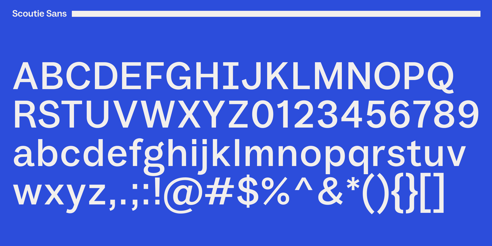
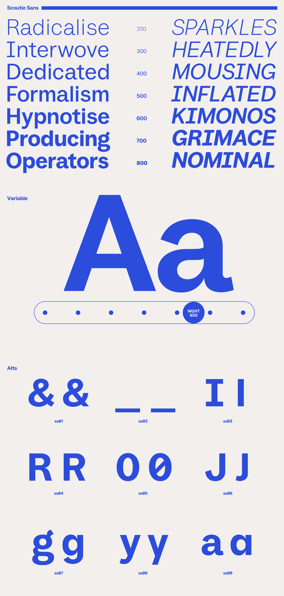

# Scoutie Sans

[![][Fontspector]](https://sursly.github.io/scoutie/fontspector/fontspector-report.html)
[![][OpenType]](https://sursly.github.io/scoutie/fontspector/fontspector-report.html)
[![][Universal]](https://sursly.github.io/scoutie/fontspector/fontspector-report.html)
[![][Google Fonts]](https://sursly.github.io/scoutie/fontspector/fontspector-report.html)
[![][Glyphset]](https://sursly.github.io/scoutie/fontspector/fontspector-report.html)

[Fontspector]: https://img.shields.io/endpoint?url=https%3A%2F%2Fsursly.github.io%2Fscoutie%2Fbadges%2FFontspectorQA.json
[OpenType]: https://img.shields.io/endpoint?url=https%3A%2F%2Fsursly.github.io%2Fscoutie%2Fbadges%2FOpentypeSpecificationChecks.json
[Universal]: https://img.shields.io/endpoint?url=https%3A%2F%2Fsursly.github.io%2Fscoutie%2Fbadges%2FUniversalProfileChecks.json
[Google Fonts]: https://img.shields.io/endpoint?url=https%3A%2F%2Fsursly.github.io%2Fscoutie%2Fbadges%2FFontFileChecks.json
[Glyphset]: https://img.shields.io/endpoint?url=https%3A%2F%2Fsursly.github.io%2Fscoutie%2Fbadges%2FGlyphsetChecks.json

Scoutie Sans was created to balance the utility of a compact UI typeface for Help Scout with hints of a display grotesk for marketing. The result is a versatile sans-serif that works equally well at small interface sizes and large headline settings.

The family spans a weight range from ExtraLight to ExtraBold (200–800), with matching italics, offered as variable fonts.

## About

Scoutie Sans was designed by [Ty Finck](https://www.tyfromtheinternet.com) for [Help Scout](https://www.helpscout.com).

## Building

Fonts are built automatically by GitHub Actions — take a look in the "Actions" tab for the latest build.

If you want to build fonts manually on your own computer:

- `make build` will produce font files.
- `make test` will run [Fontspector](https://github.com/googlefonts/fontspector)'s quality assurance tests.
- `make proof` will generate HTML proof files.

The proof files and QA test results are available via GitHub Pages at [sursly.github.io/scoutie](https://sursly.github.io/scoutie).

## Changelog

**5 October 2026. Version 1.002**
- Fix slashed zero not applying to tabular figures (`zero` + `tnum`) ([#1](https://github.com/sursly/scoutie/issues/1)).
- Fix italic diacritic alignment: Eogonek, AEacute, Bhook, Dhook and Tcedilla now follow anchors ([#2](https://github.com/sursly/scoutie/issues/2)).
- Minor kerning and outline refinements.

**1 July 2026. Version 1.001**
- First italics pass, weight fine-tuning for the Google Fonts spec, and finalized OFL copyright.

**19 May 2026. Version 1.000**
- Initial release. Variable fonts with wght (200–800) and matching italic.

## License

This Font Software is licensed under the SIL Open Font License, Version 1.1.
This license is available with a FAQ at https://openfontlicense.org

## Repository Layout

This font repository structure is inspired by [Unified Font Repository v0.3](https://github.com/unified-font-repository/Unified-Font-Repository), modified for the Google Fonts workflow.
